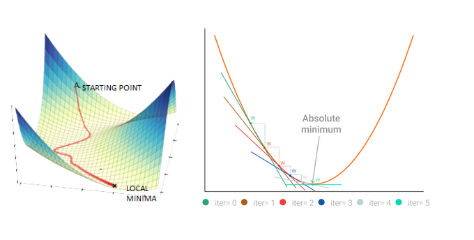

# DataDrivenAppUsingOptimalTransportAlgorithms
Data Driven App Using Optimal Transport Algorithms
# Stochastic Gradient Descent-Based Financial Models (SGDBF)
- Gradient Descent-Based Financial Model GDBF done by Joseph Bunster: 
- This is the subject of Joseph Bunster's thesis work for his master of science in mathematics at NYU-Courant. 

## Application of Gradient Descent in Financial Services
 

<!--  carbon code -- can you guess what it does? Run and see the result!
def gradient_loop(runs=3):
    """ Repeatedly computes the gradient of a function
        Computes the gradient given the starting points and then uses the result of the gradient to feed the next iteration, with new points.
        Prints out the result of the function at each iteration
        :param: runs: number of iterations to compute
    """    # starting points
    x = np.array([1, 2, 3])
    
    # quadratic function, a parabola
    y = x**2
    
    for run in range(0, runs):
        print("Iter " + str(run) + ": Y=" + str(y))        # compute first derivative
        x = np.gradient(y, 1)        # update the function output
        y = x ** 2
gradient_loop()
-->

Machine learning algorithms are programs that can learn from data and previous experience. These algorithms require some parameters which need to be finely tuned for optimal performance. This is becoming more popular especially in the financial space due to the availability of a large number of datasets and increased computational capabilities of machines.

One of the optimization techniques commonly used is gradient descent. It is a popular optimization strategy for training machine learning models by tweaking parameters iteratively to minimize a function. The gradient describes the slope of the cost function, which means moving opposite this direction will minimize the cost functions. The cost function is what we want to minimize and can be estimated from the sum of squared errors over the training set. It tells us the accuracy of the model in making predictions for a given set of parameters.

Gradient descent is of two types. Batch and stochastic gradient descent. In the batch approach, the gradient for the whole datasets is calculated and hence make use of the entire training data. This makes the process to be very slow.

In the stochastic approach, the gradient is computed using a single data point while making an update to the data. This approach is much faster than the batch approach.

Different machine learning algorithms can be used in different segments of financial markets from price detection, risk management, portfolio optimization, and volatility detection.

Gradient descent can be used for the optimizations of some of the models used in these different techniques in the financial market. Time-series analyses are usually done using regression models.

Functional gradient descent can be used to estimate volatility and conditional covariances in multivariate time series of asset price returns. In stock market prediction with regression analysis, gradient descent can be used to find the hyperparameters which directly affects the model performance

In financial risk management, k nearest neighbor can be used to produce credit score models that predict the creditworthiness of the customers. Hyperparameters involved in this model such as distance measure and a number of clusters can be optimized using gradient descent.

The general application of gradient descent is such a simple yet powerful optimization that has found to be useful in many models used in financial institutions.

That was it! :smile:.

**Update:** **Work in progress** to the "GDBF" solution is available via [Cloning or forking the project artifact](https://github.com/RedaMastouri/GradientDescentBasedFinancialModels.git).

## View & Run in Web IDE

Click on the button below to view the code in a Web IDE. Feel free to edit the code and then run it all from your browser.

- 

- 

## About the author: Joseph Bunster

Joe Bunster is hardworking mathematics professional, passionate about applying his technical background to solving real world problems. He enjoys challenges and thrive under pressure, these traits helped me successfully compete in the 2018 US National Collegiate Mathematics Championship where he placed 3rd in the United States.

Currently enrolled in a Masters of Science in Mathematics Program at NYU-Courant, with an expected graduation date of May 2021. He has previous research experience in Financial Engineering, Optimal Control Theory, and Reinforcement Learning.

Interests in Applied Math, Probability, Optimization and Finance.

**linkedin:**  [Joseph Bunster](https://www.linkedin.com/in/joseph-bunster/).
